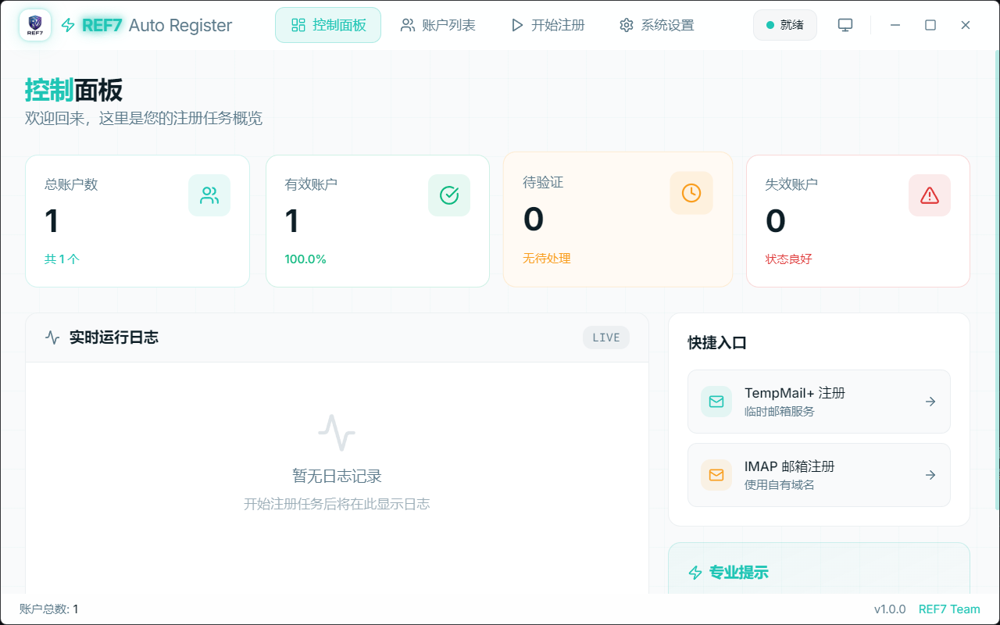
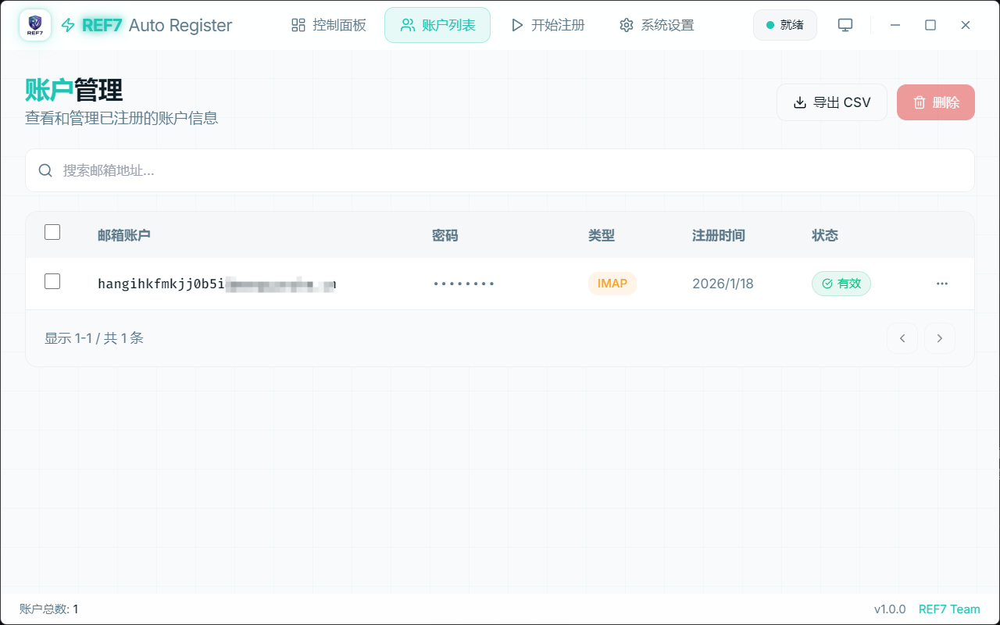
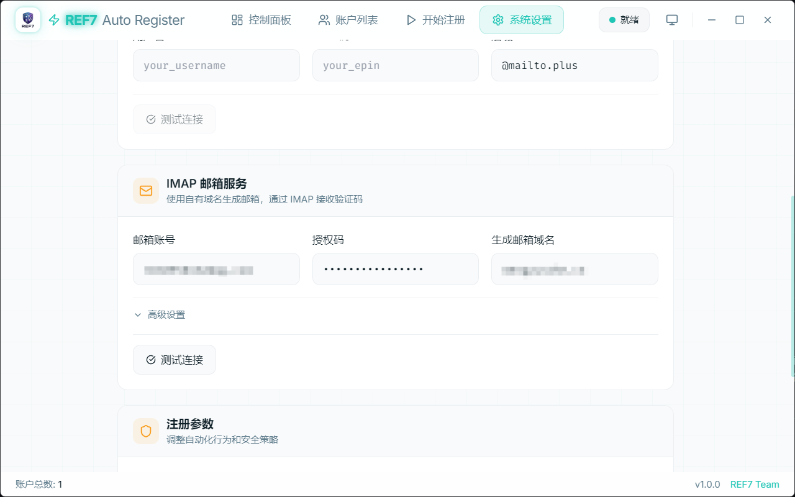

<p align="center">
  
</p>

<h1 align="center">REF7 Auto Register</h1>

<p align="center">
  <strong>一款优雅的 Context7自动化账户注册管理工具</strong>
</p>

<p align="center">
  
  
  
</p>

<p align="center">
  <a href="#功能特性">功能特性</a> •
  <a href="#技术栈">技术栈</a> •
  <a href="#快速开始">快速开始</a> •
  <a href="#使用指南">使用指南</a> •
  <a href="#配置说明">配置说明</a>
</p>

---

## 项目简介

REF7 Auto Register 是一款基于 Electron 的桌面应用程序，专为 [Context7.com](https://context7.com) 自动化账户注册流程而设计。它集成了智能浏览器自动化、Cloudflare Turnstile 验证绕过、邮件验证码自动获取、账户与 API Key 批量管理等功能，提供了一站式的注册解决方案。

应用采用现代化的 Cyberpunk 风格 UI 设计，支持深色/浅色主题切换，提供流畅的动画效果和优秀的用户体验。

## 更新日志

### v1.3.0
- 🎉 版本更新

### v1.1.0
- ✨ 新增 Context7.com 注册支持与 API Key 自动获取
- 🔑 新增 API Key 管理功能，支持查看配额与使用情况
- 🚀 优化浏览器自动化，增强反检测能力
- 🖥️ 新增后台隐藏模式，浏览器窗口可自动隐藏到屏幕外
- 💎 UI 优化：新增确认弹窗组件，提升交互体验
- 🛠️ 重构数据库服务与 IPC 处理逻辑

## 功能特性

### 🚀 自动化注册
- **智能浏览器自动化**：基于 puppeteer-real-browser，自动绕过 Cloudflare Turnstile 验证
- **后台隐藏模式**：浏览器窗口可隐藏到屏幕外并从任务栏移除，实现真正的后台运行
- **增强反检测**：禁用自动化特征检测，模拟真实浏览器指纹
- **批量注册支持**：单次可配置注册 1-20 个账户
- **随机密码生成**：自动生成包含大小写字母、数字和特殊字符的安全密码
- **可配置注册间隔**：随机延迟策略，模拟人工行为

### 📧 双邮箱服务支持
- **TempMail+ 临时邮箱**：无需自有域名，快速注册
- **IMAP 邮箱服务**：支持自有域名邮箱，通过 IMAP/POP3 协议接收验证码

### 🔑 API Key 管理
- **自动获取 API Key**：注册完成后自动获取 Context7 API Key
- **配额追踪**：显示每个账户的 API 请求配额和使用情况
- **一键复制**：快速复制 API Key 到剪贴板

### 📊 账户管理
- **账户状态追踪**：实时显示有效、待验证、失效账户统计
- **搜索与筛选**：支持按邮箱地址快速搜索
- **批量操作**：支持批量选择和删除
- **数据导出**：支持导出为 CSV/JSON 格式

### 🎨 现代化界面
- **Cyberpunk 风格设计**：独特的视觉效果，neon 发光效果
- **主题切换**：支持深色、浅色和跟随系统三种模式
- **流畅动画**：基于 Framer Motion 的丝滑过渡效果
- **响应式布局**：适配不同屏幕尺寸

### 📝 实时日志
- **彩色日志输出**：不同类型日志以不同颜色区分
- **实时滚动**：自动滚动到最新日志
- **日志清空**：一键清空历史日志

## 应用截图

### 控制面板

*控制面板展示账户统计概览、实时运行日志和快捷操作入口*

### 账户列表

*账户列表支持查看、搜索、导出和批量管理已注册的账户*

### 系统设置

*系统设置页面配置邮箱服务、注册参数和外观主题*

## 技术栈

### 前端
- **React 19** - 用户界面构建
- **TypeScript** - 类型安全的 JavaScript
- **Tailwind CSS** - 原子化 CSS 框架
- **Framer Motion** - 动画库
- **Lucide React** - 图标库

### 后端 (Electron)
- **Electron 34** - 跨平台桌面应用框架
- **puppeteer-real-browser** - 反检测浏览器自动化
- **sql.js** - SQLite 数据库 (WebAssembly)
- **imap** - IMAP 协议客户端
- **mailparser** - 邮件解析

### 构建工具
- **Vite** - 现代化构建工具
- **electron-builder** - Electron 应用打包

## 快速开始

### 环境要求

- Node.js 18+
- npm 或 yarn

### 安装依赖

```bash
# 克隆项目
git clone https://github.com/ref7/ref7-auto-register.git
cd ref7-auto-register

# 安装依赖
npm install
```

### 开发模式

```bash
# 启动开发服务器
npm run electron:dev
```

### 构建应用

```bash
# 构建 Windows 安装包
npm run electron:build:win

# 或通用构建
npm run electron:build
```

构建产物将输出到 `release` 目录。

## 使用指南

### 1. 配置邮箱服务

在开始注册之前，需要先配置邮箱服务。进入 **系统设置** 页面：

#### TempMail+ 配置
1. 访问 [tempmail.plus](https://tempmail.plus) 创建账户
2. 获取用户名和 EPIN 码
3. 在设置中填入相应信息
4. 点击"测试连接"验证配置

#### IMAP 邮箱配置
1. 填写邮箱账号（如 QQ 邮箱）
2. 获取并填入授权码（非登录密码）
3. 配置生成邮箱的域名（需要域名邮箱转发支持）
4. 可选配置 IMAP 服务器、端口等高级选项
5. 点击"测试连接"验证配置

### 2. 开始注册

进入 **开始注册** 页面：

1. 选择邮箱服务类型（TempMail+ 或 IMAP）
2. 设置批量数量（1-20）
3. 可选开启调试模式（显示浏览器窗口）
4. 点击"启动任务"开始自动注册
5. 在右侧面板查看实时日志

### 3. 管理账户

进入 **账户列表** 页面：

- 查看所有已注册账户及其 API Key
- 使用搜索框快速定位账户
- 点击复选框批量选择账户
- 一键复制 API Key 到剪贴板
- 导出账户数据为 CSV 格式
- 删除不需要的账户

### 4. 使用 API Key

注册成功后，每个账户都会自动获取 Context7 API Key：

1. 在账户列表中找到目标账户
2. 点击 API Key 旁的复制按钮
3. 将 API Key 用于你的 Context7 API 调用

## 配置说明

### 注册参数

| 参数 | 说明 | 默认值 |
|------|------|--------|
| 密码长度 | 生成密码的字符数 | 12 |
| 注册间隔 | 批量注册时每个账户之间的等待时间 | 3-8 秒 |
| 超时时间 | 等待验证码的最大时间 | 60 秒 |
| 调试模式 | 是否显示浏览器窗口（关闭时使用后台隐藏模式） | 关闭 |

### 账户数据字段

| 字段 | 说明 |
|------|------|
| email | 注册邮箱地址 |
| password | 账户密码 |
| emailType | 邮箱类型 (tempmail_plus / imap) |
| status | 账户状态 (active / pending / invalid) |
| apiKey | Context7 API Key |
| apiKeyName | API Key 名称 |
| requestsLimit | API 请求配额限制 |

### 数据存储

应用数据存储在用户数据目录：

- Windows: `%APPDATA%/ref7-auto-register/data/ref7.db`
- macOS: `~/Library/Application Support/ref7-auto-register/data/ref7.db`
- Linux: `~/.config/ref7-auto-register/data/ref7.db`

## 项目结构

```
ref7-auto-register/
├── assets/                  # 静态资源
│   └── icon.png            # 应用图标
├── electron/               # Electron 主进程
│   ├── main.ts            # 主进程入口
│   ├── preload.ts         # 预加载脚本
│   ├── ipc/
│   │   └── handlers.ts    # IPC 通信处理
│   └── services/
│       ├── browser.ts     # 浏览器自动化服务
│       ├── database.ts    # 数据库服务
│       └── email/
│           ├── imap.ts    # IMAP 邮件服务
│           └── tempmailplus.ts  # TempMail+ 服务
├── src/                    # React 前端
│   ├── App.tsx            # 根组件
│   ├── main.tsx           # 入口文件
│   ├── components/        # UI 组件
│   │   ├── Dashboard.tsx  # 控制面板
│   │   ├── AccountList.tsx # 账户列表
│   │   ├── RegisterPanel.tsx # 注册面板
│   │   ├── Settings.tsx   # 系统设置
│   │   └── Notification.tsx # 通知组件
│   ├── styles/
│   │   └── globals.css    # 全局样式
│   └── types/
│       └── index.ts       # TypeScript 类型定义
├── index.html             # HTML 入口
├── vite.config.ts         # Vite 配置
├── tailwind.config.js     # Tailwind 配置
├── electron-builder.yml   # 打包配置
└── package.json           # 项目配置
```

## 开发说明

### 脚本命令

```bash
# 启动 Vite 开发服务器（仅前端）
npm run dev

# 启动 Electron 开发模式
npm run electron:dev

# 构建前端
npm run build

# 构建 Windows 安装包
npm run electron:build:win
```

### 调试技巧

1. **开启调试模式**：在设置中开启"调试模式"可以看到浏览器自动化的操作过程
2. **查看日志**：注册过程的详细日志会实时显示在运行日志面板
3. **开发者工具**：在开发模式下可以使用 Chrome DevTools 调试

## 注意事项

- 本工具仅供学习和研究使用
- 请遵守目标网站的使用条款和服务协议
- 过于频繁的注册可能会触发风控机制
- 建议合理设置注册间隔时间

## 许可证

MIT License - 详见 [LICENSE](LICENSE) 文件

---

<p align="center">
  Made with ❤️ by <a href="https://github.com/ref7">REF7 Team</a>
</p>
