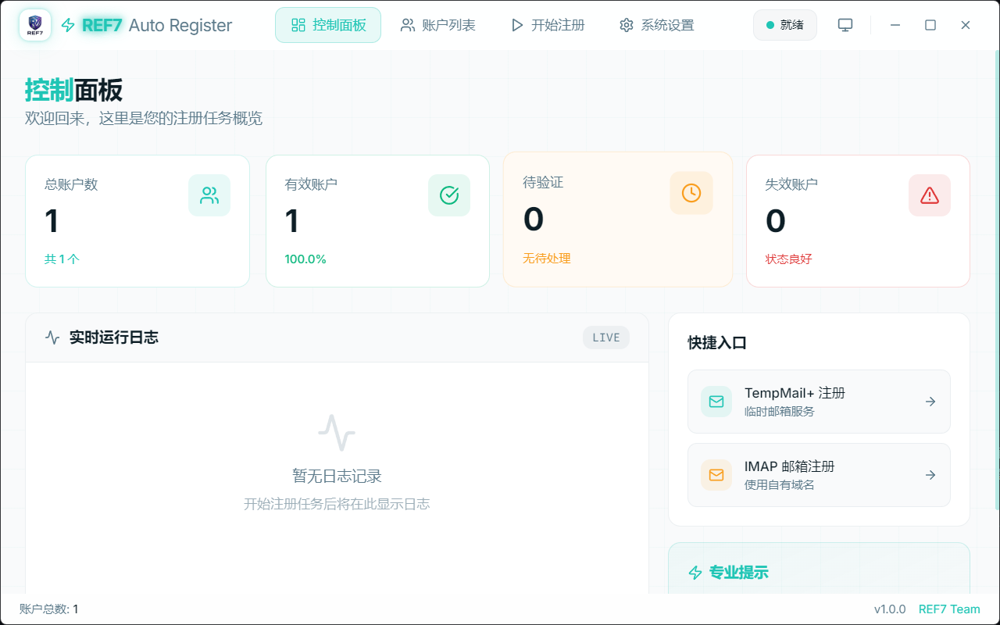
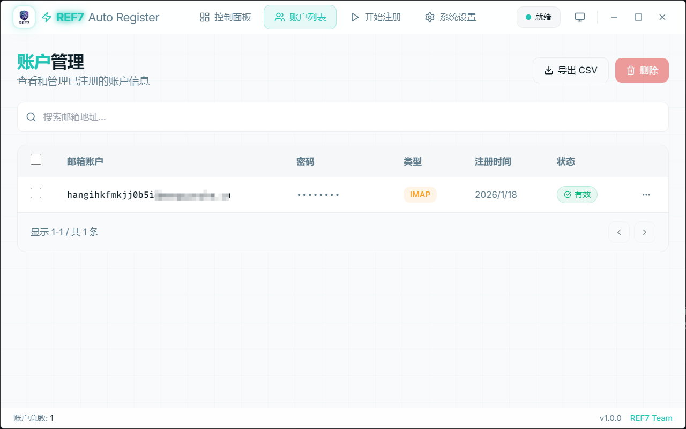
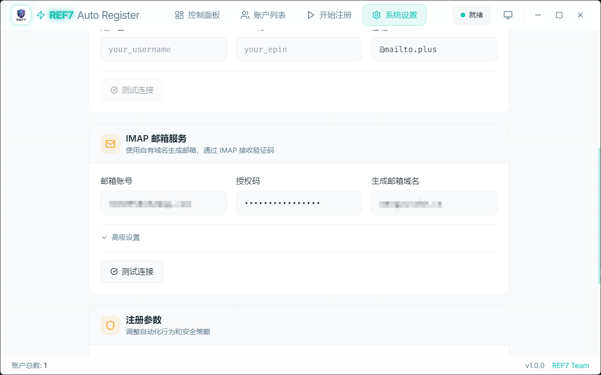

<p align="center">
  
</p>

<h1 align="center">REF7 Auto Register</h1>

<p align="center">
  <strong>Context7 与 Ref.tools 的自动化注册与账户管理桌面端</strong>
</p>

<p align="center">
  
  
  
</p>

<p align="center">
  <a href="#项目简介">项目简介</a> •
  <a href="#能做什么">能做什么</a> •
  <a href="#仓库结构">仓库结构</a> •
  <a href="#技术栈">技术栈</a> •
  <a href="#快速开始">快速开始</a> •
  <a href="#使用指南">使用指南</a>
</p>

---

## 项目简介

**REF7 Auto Register** 是一款基于 **Electron + React + TypeScript** 的跨平台桌面应用，面向两类产品能力：

1. **[Context7](https://context7.com)**：自动化完成注册、邮箱验证、Clerk 登录与 **API Key** 获取，并支持通过 HTTP 拉取额度 / 控制台请求统计，在界面侧展示与刷新。
2. **[Ref.tools](https://ref.tools)**：通过浏览器自动化（`puppeteer-real-browser`）与 **Ref HTTP API**（`ref-api`）相结合的方式，完成 Ref 侧注册与 **Ref API Key** 管理；邮件中可自动识别验证链接。

应用将**渲染进程**（`src/`）与**主进程**（`electron/`）通过 **preload + 类型化的 `electronAPI`** 通信；共享的默认设置与类型放在 **`shared/`**，避免前后端各写一份。数据落在本地 **SQLite（sql.js）**。UI 为 Cyberpunk 风格，支持深色 / 浅色 / 跟随系统，并带实时日志与通知。

> 完整版本历史见 [CHANGELOG.md](CHANGELOG.md)。

## 能做什么

### 自动化注册与补全

- **Context7**：批量注册（可配间隔与批量上限）、Turnstile 等验证场景下的反检测浏览器自动化；验证邮件与「已注册」类通知的**分流处理**；验证后可**以接口为主**继续后续步骤。
- **Ref.tools**：注册面板支持 **Context7 模式**与 **Ref 模式**；Ref 侧可用浏览器自动化或后端 API 路径；可选调试模式显示浏览器窗口。
- **邮箱**：**TempMail+** 与 **IMAP**（含 Cloudflare Email Routing 等转发场景）；支持验证码与 Ref 验证链接提取。

### 账户与密钥

- **Context7 API Key**、**Ref API Key** 的展示、复制与缺失时的**补注册 / 刷新**流程。
- **额度与用量**：主进程中的 Ref / Context7 **credits** 与控制台请求类信息拉取，账户列表等处展示。

### 数据与体验

- 账户 **导入 / 导出（JSON）**、搜索、批量删除、密码显隐。
- **关于**页与 **GitHub Release** 版本对比；集成 **electron-updater** 的自动更新（以 Release 为准）。
- **Dashboard** 概览、**设置**（通用 / 账号 / 高级）、彩色实时日志。

## 仓库结构

| 路径 | 说明 |
|------|------|
| `src/` | React 19 界面：页面组件、`hooks/`（主题、通知、注册副作用）、`utils/`、`types/` |
| `electron/` | 主进程入口 `main.ts`、`preload.ts`、`ipc/handlers.ts` |
| `electron/services/` | 浏览器、`database`、`email/`、`context7-requests`、`ref-api`、`ref-credits`、`ref-browser`、`updater` 等 |
| `electron/utils/` | 邮件分类、`describe-fetch-error` 等工具 |
| `shared/` | 渲染与主进程共用的默认设置与类型 |
| `docs/` | 截图、Ref/Context7 分析笔记与辅助脚本 |

构建产物与安装包由 **Vite + electron-builder** 生成，默认输出在 `release/`。

## 更新日志（摘录）

### v1.7.5（2026-03-29）

- 类型与设置共享目录 **`shared/`**，`App` 抽 hooks、样式与 Preload/IPC 精简，浏览器服务整理；文档同步本版。

### v1.7.4（2026-03-29）

- Context7 请求与 Ref 额度服务、IPC 与账户列表等方面持续优化。

### v1.7.3（2026-03-29）

- Context7 邮件分流（验证码 / 已注册通知）、浏览器会话桥接、验证后偏接口的续跑流程。

### v1.7.0（2026-03-28）

- Ref.tools **HTTP API 集成**、文档与 IPC / 注册面板大更新。

### v1.5.3（2026-03-21）

- Ref / Context7 **额度 HTTP 拉取**、Clerk 与 Dashboard 请求信息、GitHub Release 上传等 CI 调整。

更早版本见 [CHANGELOG.md](CHANGELOG.md)（含 1.5.x Ref 浏览器注册、1.4.x 关于页与导入导出、自动更新与多平台 CI 等）。

## 功能特性（详细）

### 自动化注册

- **智能浏览器自动化**：基于 puppeteer-real-browser，减轻 Cloudflare Turnstile 等风控影响。
- **后台隐藏模式**：可将窗口置于屏幕外并弱化任务栏展示，便于无人值守。
- **批量与节奏**：可配置批量数量、随机间隔、超时与默认邮箱类型。

### 邮箱

- **TempMail+**：快速对接，适合与 CF 邮件路由组合。
- **IMAP**：自有邮箱或企业邮箱；与 CF Email Routing 搭配可实现「任意子地址」收信。

### API Key 与额度

- **Context7**：注册后 API Key；支持 Clerk 登录链路与控制台请求类数据展示。
- **Ref**：Ref API Key；**ref-api** 与 **ref-browser** 双路径；额度信息拉取与界面刷新。

### 账户与数据

- 状态统计、搜索、批量操作、CSV/JSON 导出、JSON 导入。
- 本地 SQLite 持久化，无服务端账号体系。

### 界面

- Cyberpunk 风格、Framer Motion 动效、Lucide 图标、Tailwind 工具类。

## 应用截图

<table>
  <tr>
    <td align="center">
      <br>
      <em>控制面板 - 账户统计概览与实时日志</em>
    </td>
    <td align="center">
      <br>
      <em>账户列表 - 搜索、导出和批量管理</em>
    </td>
  </tr>
  <tr>
    <td align="center">
      <br>
      <em>系统设置 - 邮箱服务与外观主题配置</em>
    </td>
    <td align="center"></td>
  </tr>
</table>

## 技术栈

### 前端

- **React 19**、**TypeScript**、**Tailwind CSS**、**Framer Motion**、**Lucide React**

### Electron 主进程

- **Electron 34**、**puppeteer-real-browser**、**sql.js**、**imap**、**mailparser**、**electron-updater**、**electron-log**

### 构建

- **Vite 6**、**electron-builder**

## 快速开始

### 环境要求

- Node.js 18+
- npm 或 yarn

### 安装依赖

```bash
git clone https://github.com/mengqi1436/Ref7-Auto.git
cd Ref7-Auto
npm install
```

### 开发调试

```bash
npm run electron:dev
```

Windows 下可使用仓库根目录的 `start-dev.bat` 启动本地开发流程。

### 打包

```bash
npm run electron:build:win    # Windows
npm run electron:build:mac    # macOS
npm run electron:build:linux # Linux
npm run electron:build        # 按当前平台默认目标
```

安装包与相关产物通常在 `release/` 目录。

## 使用指南

### 1. 配置 Cloudflare 域名邮箱（推荐与 IMAP / 路由配合）

1. 将域名托管到 [Cloudflare](https://dash.cloudflare.com)，完成 DNS 切换。
2. 在 **电子邮件路由** 中启用服务，按需配置 **Catch-all** 或具体地址，将邮件**转发到你的真实收件邮箱**（如 QQ 或 TempMail+ 地址）。

### 2. 在应用内配置邮箱

**TempMail+**：在设置中填写用户名、EPIN、扩展域；将 CF 路由目标设为对应 `mailto.plus` 地址。

**IMAP**：填写真实收件邮箱的 IMAP 与授权码；在设置中填写用于**注册用别名**的域名（CF 上托管的域名），使应用能生成 `xxx@你的域名`。

### 3. 开始注册

在 **开始注册** 中选择 **Context7** 或 **Ref** 流程、邮箱类型、批量数量；可选显示浏览器；通过日志与通知观察进度。

### 4. 管理账户与密钥

在 **账户列表** 中搜索、导出、复制 **Context7** / **Ref** API Key；对缺失项使用界面上的补全或注册操作；按需刷新额度信息。

### 5. 调用 API

将复制到的 **Context7** 或 **Ref** API Key 用于各自官方 API（请遵守服务条款与速率限制）。

## 注意事项

- 本工具仅供学习与研究使用。
- 请遵守 Context7、Ref 及其他第三方服务的使用条款。
- 过高频率的注册或请求可能触发风控；请合理设置间隔与批量参数。

## 许可证

MIT License — 详见 [LICENSE](LICENSE)。

---

<p align="center">
  Made with ❤️ by <a href="https://github.com/ref7">REF7 Team</a>
</p>
